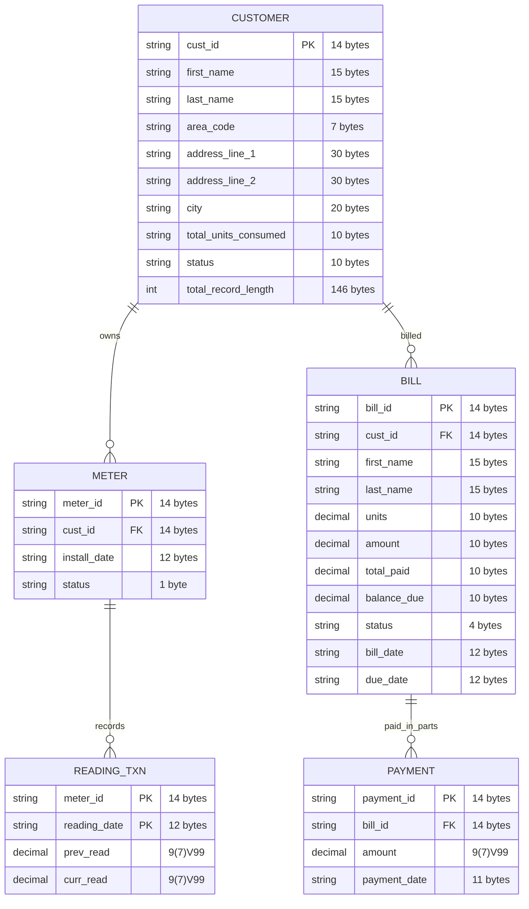

# Electricity Billing System - Project Overview

Detailed documentation for the Mainframe Capstone Project implementing a batch-oriented Electricity Billing System using COBOL and JCL.

---

## Table of Contents

1. [System Overview](#system-overview)
2. [Data Model](#data-model)
3. [Dataset Specifications](#dataset-specifications)
4. [Program Architecture](#program-architecture)
5. [Execution Flow](#execution-flow)

---

## System Overview

This project implements a **batch-oriented Electricity Billing System** using **COBOL and JCL**, with datasets representing logical tables. The system simulates how electricity boards process monthly meter readings, generate bills, track payments, and produce analytical reports.

### Design Principles

The design follows **mainframe batch processing principles**:

- Sequential dataset processing
- Master vs Transaction vs Derived datasets
- Periodic batch jobs
- Deterministic data flow between programs
- Data validation and reconciliation

### System Evolution

Initially the system uses **Sequential datasets / VSAM datasets**.  
Later the system can be extended to:

- **DB2** for relational storage (see `db2/` folder)
- **CICS** for online transactions like payments and bill inquiry

### Core Datasets

The system revolves around the following datasets:

- **CUSTOMER** (Master) - Customer records
- **METER** (Master) - Meter records linked to customers
- **READING_TXN** (Transaction) - Periodic meter readings
- **BILL** (Derived) - Generated bills from readings
- **PAYMENT** (Transaction) - Payment transactions

---

## Data Model

### Entity Relationship Diagram



### Data Flow

```
CUSTOMER (Master) → METER (Master) → READING_TXN (Transaction)
                                            ↓
                                    BILLGEN Program
                                            ↓
                                    BILL (Derived)
                                            ↓
                                    PAYMENT (Transaction)
                                            ↓
                                    BILL_UPDATE (Derived)
                                            ↓
                                    Reports
```

**CUSTOMER.total_units_consumed** is updated during bill generation.

---

## Dataset Specifications

### CUSTOMER (Master Dataset)

This dataset stores all permanent customer information and acts as the **root dataset** because most operations eventually map to a customer.

#### Fields

| Field | PIC Clause | Key | Description |
|-------|------------|-----|-------------|
| cust_id | X(14) | PK | Customer ID (auto-generated) |
| first_name | X(15) | | Customer first name |
| last_name | X(15) | | Customer last name |
| area_code | X(7) | | Geographic area code (e.g., DELHI01) |
| address_line_1 | X(30) | | Street address |
| address_line_2 | X(30) | | Locality/area |
| city | X(20) | | City name |
| total_units_consumed | X(10) | | Cumulative units consumed |
| status | X(10) | | Customer status |

**Record Length:** 146 bytes

#### COBOL Data Types

- `X(n)` = Alphanumeric (n characters)
- `9(m)V99` = Numeric with m digits before decimal, 2 after

#### Example Records

| cust_id | first_name | last_name | area_code | city | status |
|---------|------------|-----------|-------------|------|--------|
| ABKODEL123456 | ABHINAV | KODURU | DELHI01 | DELHI | ACTIVE |
| RJSHDEL789012 | RAJESH | SHARMA | DELHI01 | DELHI | ACTIVE |
| SKMABOM456789 | SURESH | KUMAR | BOMBAY02 | MUMBAI | ACTIVE |

#### Programs That Update

- `ELECTDB2` / `ELECT001` - Customer registration program
- `BILLPAYDB2` - Bill generation program (updates total_units_consumed)

---

### METER (Master Dataset)

This dataset stores details about the electricity meter assigned to a customer.

#### Fields

| Field | PIC Clause | Key | Description |
|-------|------------|-----|-------------|
| meter_id | X(14) | PK | Meter ID (auto-generated) |
| cust_id | X(14) | FK | Customer ID reference |
| install_date | X(12) | | Installation date (YYYY-MM-DD) |
| status | X(1) | | A=Active, I=Inactive |

**Record Length:** 41 bytes

#### Status Values

| Status | Meaning |
|--------|---------|
| A | Active |
| I | Inactive |
| R | Replaced |

#### Example Records

| meter_id | cust_id | install_date | status |
|----------|---------|-------------|--------|
| MTR-AB031596847 | ABKODEL123456 | 2023-01-15 | A |
| MTR-RS071234567 | RJSHDEL789012 | 2023-01-20 | A |
| MTR-SK041596847 | SKMABOM456789 | 2023-02-10 | A |

#### Programs That Update

- `METERDB2` - Meter registration program

---

### READING_TXN (Transaction Dataset)

This dataset stores periodic electricity readings.

**Primary Key:** meter_id + reading_date

#### Fields

| Field | PIC Clause | Key | Description |
|-------|------------|-----|-------------|
| meter_id | X(14) | PK | Meter ID reference |
| reading_date | X(10) | PK | Reading date (YYYY-MM-DD) |
| prev_read | 9(7)V99 | | Previous meter reading |
| curr_read | 9(7)V99 | | Current meter reading |

**Record Length:** 29 bytes

#### Calculations

**Units consumed** are calculated as:

```
units_consumed = curr_read - prev_read
```

#### Validation Rules

- `curr_read` must be greater than or equal to `prev_read`
- Extremely high consumption values may indicate fraud

#### Example Records

| meter_id | reading_date | prev_read | curr_read |
|----------|-------------|-----------|-----------|
| MTR-001 | 2023-06-01 | 1000.00 | 1150.50 |
| MTR-001 | 2023-07-01 | 1150.50 | 1320.25 |
| MTR-002 | 2023-06-01 | 800.00 | 920.75 |

This dataset is the **primary input for bill generation**.

---

### BILL (Derived Dataset)

This dataset is created after processing meter readings.

#### Fields

| Field | PIC Clause | Key | Description |
|-------|------------|-----|-------------|
| bill_id | X(14) | PK | Bill ID (auto-generated) |
| cust_id | X(14) | FK | Customer ID reference |
| first_name | X(15) | | Customer first name |
| last_name | X(15) | | Customer last name |
| units | 9(10) | | Units consumed this period |
| amount | 9(10) | | Total bill amount |
| total_paid | 9(10) | | Amount paid so far |
| balance_due | 9(10) | | Remaining balance |
| status | X(4) | | D=Due, PP=Partially Paid, P=Paid |
| bill_date | X(12) | | Bill generation date |
| due_date | X(12) | | Payment due date |

**Record Length:** 112 bytes

#### Status Values

| Status | Meaning |
|--------|---------|
| D | Due |
| PP | Partially Paid |
| P | Paid |

#### Example Records

| bill_id | cust_id | units | amount | total_paid | balance_due | status |
|---------|---------|-------|--------|------------|-------------|--------|
| B001-202306 | CUST001 | 150.50 | 376.25 | 0.00 | 376.25 | D |
| B002-202306 | CUST002 | 120.75 | 301.88 | 150.00 | 151.88 | PP |
| B003-202307 | CUST001 | 169.75 | 424.38 | 424.38 | 0.00 | P |

#### Programs That Update

- `BILLPAYDB2` - Bill generation program

---

### PAYMENT (Transaction Dataset)

This dataset stores payment transactions.

#### Fields

| Field | PIC Clause | Key | Description |
|-------|------------|-----|-------------|
| payment_id | X(8) | PK | Payment ID (auto-generated) |
| bill_id | X(14) | FK | Bill ID reference |
| amount | 9(7)V99 | | Payment amount |
| payment_date | X(10) | | Payment date (YYYY-MM-DD) |

**Record Length:** 33 bytes

#### Important Concept: Multiple Payments

Bills can be paid in **multiple installments**.

**Example:**
- Bill amount = 5000
- Payment 1: 2000
- Payment 2: 1500
- Payment 3: 1500

The BILL dataset maintains running totals of payments.

#### Example Records

| payment_id | bill_id | amount | payment_date |
|------------|---------|--------|--------------|
| P001 | B002-202306 | 150.00 | 2023-06-15 |
| P002 | B002-202306 | 151.88 | 2023-06-25 |
| P003 | B003-202307 | 200.00 | 2023-07-10 |

---

### BILL_UPDATE (Derived Dataset)

This dataset stores updated bill records after payment processing.

#### Fields

| Field | PIC Clause | Key | Description |
|-------|------------|-----|-------------|
| bill_id | X(14) | PK | Bill ID |
| cust_id | X(14) | FK | Customer ID reference |
| first_name | X(15) | | Customer first name |
| last_name | X(15) | | Customer last name |
| units | 9(10) | | Units consumed |
| amount | 9(10) | | Total bill amount |
| paid | 9(10) | | Total amount paid |
| balance | 9(10) | | Remaining balance |
| status | X(4) | | D=Due, PP=Partially Paid, P=Paid |

**Record Length:** 121 bytes

#### Programs That Update

- `BILLPAYDB2` - Payment processing program

---

## Dataset Creation Order

Datasets must be created in the following order to maintain data dependencies:

| Step | Dataset | Dependencies |
|------|---------|--------------|
| 1 | CUSTOMER | None (root dataset) |
| 2 | METER | CUSTOMER (FK: cust_id) |
| 3 | READING_TXN | METER (PK: meter_id) |
| 4 | BILL | CUSTOMER (FK: cust_id) |
| 5 | PAYMENT | BILL (FK: bill_id) |
| 6 | BILL_UPDATE | BILL, PAYMENT |

---

## Program Architecture

### Implemented Programs

The system consists of COBOL batch programs executed through JCL steps.

#### VSAM Version (cobol/)

| Program | File | Purpose |
|---------|------|---------|
| ELECT001 | `elect001.cobol` | Customer data load to VSAM |
| BILLPAY | `billpay.cobol` | Bill payment processing |
| AREARPT | `arearpt.cobol` | Area-wise consumption report |
| HIGHCONS | `highcons.cobol` | High consumption alert report |

#### DB2 Version (db2/)

| Program | File | Purpose |
|---------|------|---------|
| ELECTDB2 | `electdb2.cobol` | Customer data load to DB2 |
| METERDB2 | `meterdb2.cobol` | Meter data load to DB2 |
| BILLPAYDB2 | `billpaydb2.cobol` | Payment processing with DB2 |
| AREARPTDB2 | `arearptdb2.cobol` | Area report using DB2 |
| HIGHCONSDB2 | `highconsdb2.cobol` | High consumption report using DB2 |

---

### Program Descriptions

#### 1. Customer Data Load (ELECTDB2 / ELECT001)

**Purpose:** Read customer data from sequential file and insert into CUSTOMER table/dataset.

**Process:**
1. Connect to DB2 / Open VSAM dataset
2. Read customer records from input file
3. Validate data (check for empty name/city fields)
4. Generate unique Customer IDs using algorithm: `FN(2) + LN(2) + AreaCode(4) + RAND(4)`
5. Insert valid records into CUSTOMER
6. Write error records to error file

**Output:** Populated CUSTOMER table/dataset, error file

---

#### 2. Meter Data Load (METERDB2)

**Purpose:** Read meter data from sequential file and insert into METER table.

**Process:**
1. Connect to DB2
2. Read meter records from input file
3. Validate data (check for empty meter ID)
4. Generate unique Meter IDs using algorithm: `MTR- + chars + date + random`
5. Insert valid records into METER
6. Calculate consumption data for each meter
7. Write error records to error file

**Output:** Populated METER table, error file, consumption calculations

---

#### 3. Area-wise Consumption Report (AREARPTDB2 / AREARPT)

**Purpose:** Generate area-wise electricity consumption report.

**Process:**
1. Connect to DB2 / Open VSAM
2. Fetch all customers ordered by area code
3. For each customer:
   - Fetch associated meter
   - Match meter readings from transaction file
   - Calculate consumption and bill amount (rate: 5.50)
4. Generate formatted report with:
   - Area-wise customer details
   - Consumption and bill amounts
   - Area subtotals
   - Grand totals

**Output:** Formatted area-wise consumption report

---

#### 4. High Consumption Report (HIGHCONSDB2 / HIGHCONS)

**Purpose:** Identify and report the top 5 highest electricity consuming customers.

**Process:**
1. Connect to DB2 / Open VSAM
2. Read all transaction records (meter readings)
3. For each transaction:
   - Fetch meter from METER table
   - Fetch customer from CUSTOMER table
   - Calculate consumption
   - Apply **tiered billing rates**:
     - 0-100 units: 3.50 per unit
     - 101-300 units: 5.50 per unit
     - 301-500 units: 5.50 per unit
     - 501+ units: 7.50 per unit (flagged as HIGH)
4. Maintain TOP 5 list in memory
5. Generate formatted report

**Output:** Top 5 customers report with tiered billing

---

#### 5. Bill Payment Status Report (BILLPAYDB2 / BILLPAY)

**Purpose:** Process bill payments and generate payment status report.

**Process:**
1. Connect to DB2 / Open VSAM
2. Open cursor on BILL table / Open BILL dataset
3. Read payment records from sequential file
4. For each bill:
   - Read all payments for that bill ID
   - Calculate total paid amount
   - Determine payment status:
     - **D** (Due) = No payments made
     - **PP** (Partially Paid) = Some payment but less than bill amount
     - **P** (Paid) = Payment equals or exceeds bill amount
   - Insert updated record into BILL_UPDATE table
5. Generate formatted report

**Output:** Payment status report, BILL_UPDATE table

---

## Execution Flow

### Daily Operations

```
ELECT001/ELECTDB2 → METERDB2
(Customer Load)     (Meter Load)
```

### Monthly Analytics Pipeline

```
READING_TXN → BILLGEN → AREARPT/HIGHCONS/BILLPAY
(Input)       (Generate Bills)  (Reports)
                    ↓
              PAYMENT → BILL_UPDATE
              (Process Payments)
```

### JCL Job Chaining

Programs are chained through **JCL job steps**:

```jcl
//MONTHLY  JOB 'MONTHLY BILLING','BATCH',CLASS=A
//*
//STEP1    EXEC PGM=ELECT001     <- Load new customers
//STEP2    EXEC PGM=METERDB2     <- Load new meters
//STEP3    EXEC PGM=BILLGEN      <- Generate bills
//STEP4    EXEC PGM=BILLPAYDB2   <- Process payments
//STEP5    EXEC PGM=AREARPTDB2   <- Generate area report
//STEP6    EXEC PGM=HIGHCONSDB2  <- Generate high consumption report
```

---

## Report Outputs

### 1. Area-wise Consumption Report

**Format:** 133-character print lines

**Contents:**
- Area code grouping
- Customer details (ID, name, meter ID)
- Consumption in units
- Bill amounts
- Area subtotals
- Grand totals

### 2. High Consumption Report

**Format:** 133-character print lines

**Contents:**
- Top 5 customers ranked by consumption
- Customer ID and name
- Area code
- Meter ID
- Consumption (units)
- Bill amount
- Status (NORMAL, MEDIUM, HIGH ALERT)

### 3. Bill Payment Status Report

**Format:** 133-character print lines

**Contents:**
- Bill ID and customer ID
- Bill amount
- Amount paid
- Balance due
- Status (D, PP, P)
- Number of payments
- Summary statistics

---

## Technologies Used

| Technology | Usage |
|------------|-------|
| COBOL | Batch program development |
| JCL | Job control and execution |
| VSAM | Virtual storage access method |
| DB2 | Relational database (DB2 version) |
| Python | Test data generation |
| SQL | Database queries (DB2 version) |

---

## File Locations

| Component | Location |
|-----------|----------|
| VSAM COBOL Programs | `cobol/` |
| DB2 COBOL Programs | `db2/` |
| VSAM JCL Jobs | `jcl/` |
| DB2 Execution Guides | `db2/jcl/` |
| Test Data | `data/` |
| VSAM Datasets | `ksds/` |
| Data Generators | `python/` |
| Documentation | `docs/` |

---

*Capstone Project - Educational Use*
